# DiagAgent

DiagAgent 是一个面向专业 GUI Agent 的**诊断运行时（diagnostic runtime）与受约束恢复系统（constrained recovery system）**。

GIMP-DiagBench 提供 GIMP 任务、步骤级评估（step evaluation）和产物评估（artifact evaluation）；DiagAgent 则将这些运行记录进一步连接到：

- 故障诊断（Diagnosis）
- 修复方案生成（Repair Proposal）
- 受保护执行（Guarded Execution）
- 独立验证（Independent Verification）

---

## Architecture / Agent Loop

```mermaid
flowchart LR
    T[Task] --> A[AgentRuntime: observe / act]
    A --> E[Environment / lowering / execution]
    E --> O[Observation / trace]
    O --> V[Process + artifact evaluation]
    V --> D[Diagnosis]
    D --> P[RecoveryPolicy]
    P --> G[HealingGuard]
    G --> X[One explicit execution attempt]
    X --> I[Independent Verification]
    I --> S[RecoverySession final state]
```



现有的 `AgentRuntime` 负责：

- observation
- action
- execution
- evaluation
- termination

完整的 Agent 执行生命周期。

现有的 `HealingLoop` 接收一个显式 executor，用于执行**一次恢复尝试**。

公开 fixture 通过这一既有接口重新执行任务；它**不会创建第二套 Agent Runtime**。

---

## Diagnostic Evidence / TraceBundle

`load_trace(run_dir)` 会聚合：

- `task_public.json`
- `trace.jsonl`
- `events.jsonl`
- screenshots
- artifacts
- evaluator results

同时不会修改这些原始证据。

`TraceBundle` 会保留：

- task identity
- run identity
- public requirements
- source hashes
- source filenames
- source line numbers

它不会把**仅供 evaluator 使用的任务 gold 信息**加入 Agent 的 observation 中，从而避免评测信息泄漏。

[公开示例](examples/public_sample/README.md) 是通过实际 mock-runtime 执行生成的，并使用相对路径进行导出。

该示例包含一个错误的 `256x256` 输出，以及对应的 first-failure 证据：

```python
from diagagent.diagnosis.trace_loader import load_trace
from diagagent.diagnosis.classifier import classify_bundle
from diagagent.diagnosis.graph import build_evidence_graph

bundle = load_trace("examples/public_sample")
diagnosis = classify_bundle(bundle)
graph = build_evidence_graph(bundle, diagnosis)

print(bundle.task_id, bundle.run_id, diagnosis.first_failure_step)
```

---

## Evidence Graph / First Failure

系统使用一个简单的 JSON `nodes/edges` 结构连接以下信息：

- Task Requirement
- Subgoal
- Action
- Execution Event
- Observation
- Artifact
- First Failure
- Diagnosis

节点会保留：

- state
- events
- diagnostic source references

因此无需引入图数据库。

`classify_bundle` 会利用现有的：

- trace signals
- event signals
- evaluator signals

定位**最早被观测到的失败（earliest observed failure）**。

需要注意：

如果只有最终 artifact 失败，那么不一定能够准确确定具体是哪一个 action 导致了失败。

此外，provenance links 只是证据来源之间的连接关系，**不能被解释为一般意义上的因果证明（causal proof）**。

---

## Recovery Policy / HealingGuard

`RecoveryPolicy` 根据以下信息提出修复方案：

- diagnosis
- evidence nodes
- risk conditions
- concrete candidate action

公开 demo 中的 candidate action 来自现有的**确定性 oracle scaffold**，而不是自主 LLM planning。

`HealingGuard.validate` 用于执行恢复操作之前的边界检查。

`check` 接口会输出：

- `ALLOW`
- `DENY`

以及对应的：

- code
- reason

Guard 检查包括：

- action schema 是否合法
- 是否针对已诊断出的目标步骤
- action 是否属于允许范围
- 提供 window bbox 时，目标是否位于已有窗口范围内
- export filename 是否符合约束
- 是否超过一次恢复尝试预算

可能返回的错误码包括：

- `INVALID_ACTION`
- `WRONG_TARGET_STEP`
- `OUT_OF_SCOPE`
- `INVALID_OUTPUT_PATH`
- `BUDGET_EXCEEDED`

系统同时会检查：

- evidence references
- required approval

真实桌面环境中的窗口归属（window ownership）仍然由现有 executor 强制保证。

---

## RecoverySession / Independent Verification

系统会持久化一个 `RecoverySession`，其中记录：

- `recovery_session_id`：恢复会话 ID
- task / run
- `trigger_reason`
- `failure_type`：原始失败类型
- first failure
- diagnosis
- proposed repair
- `attempt_count`
- `max_attempts`
- guard decision
- execution result
- verification result
- `state`：最终状态

如果恢复操作被 Guard 拒绝，那么这次操作**不能被计为成功执行**。

系统还使用一个持久化 reservation 机制，防止通过创建新的 RecoverySession 来重置原始 run 的恢复次数预算。

`RecoveryVerifier` 要求同时检查：

- process
- artifact
- task
- 必要的 side effect

因此：

```text
agent 返回 success: true
```

本身**不足以证明恢复成功**。

fixture adapter 会重新读取运行证据，并对实际输出文件重新调用现有的 `ArtifactEvaluator`。

它会检查任务要求中的：

- format
- dimensions
- 其他 artifact requirements

同时还会检查：

- source hash
- output handle
- dimensions
- 现有的 full-image RGB comparison

因此，一个虽然存在且非空、但尺寸错误的 PNG 文件，仍然会被判定为失败。

需要注意：

verifier 信任 executor adapter 提供的测量结果。

它并不是一个能够防御恶意 executor 的安全 sandbox。

---

## Benchmark / Three Recovery Cases

[registry](benchmark/recovery_cases.json) 暴露了现有 `portfolio_protocol.FAMILIES` 中的三个 recovery case。

这些 case 都使用现有的 resize task。

公开 runner 是一个**确定性的 fixture/demo**，而不是新的真实 GIMP 实验。

| Case ID | First failure | Fixture 条件 | direct_retry | constrained_recovery |
|---|---:|---|---|---|
| MATCHED-PARAMETER | 2 | 持续性的 resize 参数错误：256x256 | 保留错误参数重新执行 | 受 Guard 保护地重新执行 512x512 |
| MATCHED-DIALOG | 2 | Mock resize boundary exception | 在干净条件下重新执行 | 相同干净条件下执行 guarded replay |
| MATCHED-FILEIO | 3 | Mock export boundary exception | 在干净条件下重新执行 | 相同干净条件下执行 guarded replay |

`no_recovery`：

运行并诊断原始失败，但不会进行修复。

`direct_retry`：

执行一次全新的任务 replay，但**不经过完整的 Guard 机制**。

`constrained_recovery`：

完整执行：

```text
Diagnosis
    ->
Policy
    ->
Guard
    ->
Execution
    ->
Verification
    ->
Session
```

最多允许进行一次 recovery attempt。

每一次命令调用都会生成独立的 original failure run。

需要注意：

`MATCHED-DIALOG` 和 `MATCHED-FILEIO` 中使用的 fixture exception，并不是真实发生的：

- Escape 按键
- OS file lock

Transient fault 对两个 replay 模式都会以相同方式清除，因此不会人为偏向某一种恢复策略。

---

## Quick Start

请从源码 checkout 的项目根目录运行。

推荐使用 Python 3.11。

离线 fixture：

- 不需要 GIMP
- 不需要 API Key
- 不需要模型调用

```powershell
python -m pip install -e ".[test]"

python -m diagagent.cli.main --help

python scripts/run_recovery_case.py --case MATCHED-PARAMETER --mode no_recovery

python scripts/run_recovery_case.py --case MATCHED-PARAMETER --mode direct_retry

python scripts/run_recovery_case.py --case MATCHED-PARAMETER --mode constrained_recovery
```

也可以将 case 替换为：

```text
MATCHED-DIALOG
```

或：

```text
MATCHED-FILEIO
```

每次调用都会创建一个新的输出目录。

可以通过：

```powershell
--output runs/my_case
```

指定输出目录。

但该目录必须事先不存在。

生成的 `case_result.json` 包含：

- case
- mode
- original_failure
- attempts
- guard_decisions
- process_pass
- artifact_pass
- recovered
- final_status

以及：

- original run reference
- recovery run reference
- session reference

即使 recovery 最终失败，也仍然会写出标准的、机器可读取的结果文件。

因此：

```text
process exit success
```

并不等同于：

```text
task recovery success
```

---

真实 GUI 执行额外需要：

```text
.[desktop]
```

以及：

- interactive Windows desktop
- GIMP
- 与现有 backend 相同的固定窗口配置
- 固定语言配置
- 固定 DPI 配置

可以运行：

```powershell
python -m diagagent.cli.main doctor
```

检查真实桌面执行环境是否就绪。

需要注意：

**离线 fixture 验收通过，并不意味着真实 desktop environment 已经通过验证。**

---

## Tests

```powershell
python -m pytest -q -m "not desktop and not model"

python -m pytest -q tests/test_public_recovery.py
```

测试覆盖：

- evidence links
- first failure
- Guard allow / deny
- recovery budgets
- sessions
- wrong-size files
- claimed success
- 全部 9 种 case / mode 组合

公开导出版本显式排除了两个测试文件。

这两个文件用于：

- 本地 archival portfolio packages
- publication tooling

原始 workspace 中仍然保留并执行这些测试。

详细信息请参阅：

[public packaging](docs/public/RELEASE.md)

---

## Limitations

当前实现是一个 **GIMP-first 的工程原型**。

公开 demo 使用：

- mock / Pillow execution
- 一个 resize task
- 三种注册的 fault family
- 一个 oracle scaffold
- 一次 fresh replay

因此，这些公开 demo **不能证明**：

- 真实 GUI 环境中的可靠性提升
- LLM planning 带来的收益
- 跨应用泛化能力
- 跨 layout 泛化能力
- 大规模 benchmark 性能提升

Side-effect 检查目前只覆盖声明的：

- input
- output
- dimensions
- image comparison

范围。

Diagnosis 使用的是现有规则和 observation。

因此，当前版本**没有提出新的 diagnosis accuracy claim**。

目前正式支持的安装方式是：

```text
源码 checkout
+
benchmark resources
+
editable install
```

项目不声称 standalone wheel 已经完整打包 benchmark resources。
