# DiagAgent

DiagAgent is a diagnostic runtime with constrained recovery for professional GUI agents. GIMP-DiagBench supplies GIMP tasks, step evaluation and artifact evaluation. DiagAgent connects those records to diagnosis, repair proposals, guarded execution and independent verification.

## Architecture / Agent Loop

```mermaid
flowchart LR
    T[Task] --> A[AgentRuntime: observe / act]
    A --> E[Environment / lowering / execution]
    E --> O[Observation / trace]
    O --> V[Process + artifact evaluation]
    V --> D[Diagnosis]
    D --> P[RecoveryPolicy]
    P --> G[HealingGuard]
    G --> X[One explicit execution attempt]
    X --> I[Independent Verification]
    I --> S[RecoverySession final state]
```



The existing `AgentRuntime` owns observation, action, execution, evaluation and termination. The existing `HealingLoop` accepts an explicit executor for one recovery attempt. The public fixture replays the task through that interface; it introduces no second Agent Runtime.

## Diagnostic Evidence / TraceBundle

`load_trace(run_dir)` aggregates `task_public.json`, `trace.jsonl`, `events.jsonl`, screenshots, artifacts and evaluator results without modifying them. `TraceBundle` retains task/run identity, public requirements, source hashes, source filenames and line numbers. It does not add evaluator-only task gold to agent observations.

The [public sample](examples/public_sample/README.md) was produced by actual mock-runtime execution and exported with relative paths. It includes the incorrect 256x256 output and first-failure evidence:

```python
from diagagent.diagnosis.trace_loader import load_trace
from diagagent.diagnosis.classifier import classify_bundle
from diagagent.diagnosis.graph import build_evidence_graph
bundle = load_trace("examples/public_sample")
diagnosis = classify_bundle(bundle)
graph = build_evidence_graph(bundle, diagnosis)
print(bundle.task_id, bundle.run_id, diagnosis.first_failure_step)
```

## Evidence Graph / First Failure

A simple JSON nodes/edges view connects Task Requirement, Subgoal, Action, Execution Event, Observation, Artifact, First Failure and Diagnosis. Nodes preserve state, events and diagnostic source references. No graph database is needed. `classify_bundle` locates the earliest observed failure using existing trace/event/evaluator signals; a final artifact failure alone may not identify the failing action. Provenance links are not a general causal proof.

## Recovery Policy / HealingGuard

`RecoveryPolicy` proposes a repair using diagnosis, evidence nodes, risk conditions and a concrete candidate action. Public demo candidates come from the existing deterministic oracle scaffold, not autonomous LLM planning.

`HealingGuard.validate` enforces the execution boundary; `check` exposes `ALLOW`/`DENY`, code and reason. Checks cover schema, diagnosed target step, allowed actions, existing window bbox when supplied, export filename and one-attempt budget. Codes include `INVALID_ACTION`, `WRONG_TARGET_STEP`, `OUT_OF_SCOPE`, `INVALID_OUTPUT_PATH` and `BUDGET_EXCEEDED`. Evidence references and required approval are also checked. Real desktop window ownership remains enforced by the existing executor.

## RecoverySession / Independent Verification

A persisted session records `recovery_session_id` (session ID), task/run, `trigger_reason`/`failure_type` (original failure), first failure, diagnosis, proposed repair, attempt_count/max_attempts, guard decision, execution result, verification result and `state` (final status). Denials cannot count as successful execution. A persistent reservation prevents a new session from resetting the original run's attempt budget.

`RecoveryVerifier` requires process, artifact, task and necessary side-effect checks. An agent's `success: true` alone is insufficient. The fixture adapter rereads run evidence and calls the existing `ArtifactEvaluator` on the actual file, checking the task's format, dimensions and other requirements. It also checks source hash, output handle, dimensions and the existing full-image RGB comparison. A nonempty PNG of the wrong size fails. The verifier trusts measurements from its executor adapter; it is not a sandbox against malicious executors.

## Benchmark / Three Recovery Cases

The [registry](benchmark/recovery_cases.json) exposes the three existing `portfolio_protocol.FAMILIES`, using the existing resize task. The public runner is a **deterministic fixture/demo**, not a new real-GIMP experiment.

| Case ID | First failure | Fixture condition | direct_retry | constrained_recovery |
|---|---:|---|---|---|
| MATCHED-PARAMETER | 2 | Persistent resize error: 256x256 | Retains wrong parameters | Guarded 512x512 replay |
| MATCHED-DIALOG | 2 | Mock resize boundary exception | Clean replay | Same clean conditions, guarded replay |
| MATCHED-FILEIO | 3 | Mock export boundary exception | Clean replay | Same clean conditions, guarded replay |

`no_recovery` runs and diagnoses the original failure without repair. `direct_retry` performs one fresh task replay without the full Guard. `constrained_recovery` follows Diagnosis -> Policy -> Guard -> Execution -> Verification -> Session, with at most one attempt. Each invocation generates its own original failure run. The dialog/fileio fixture exceptions are not actual Escape presses or OS file locks. Transient faults clear equally for both replay modes.

## Quick Start

Run from the source checkout root. Python 3.11 is recommended. Offline fixtures need no GIMP, API key or model call.

```powershell
python -m pip install -e ".[test]"
python -m diagagent.cli.main --help
python scripts/run_recovery_case.py --case MATCHED-PARAMETER --mode no_recovery
python scripts/run_recovery_case.py --case MATCHED-PARAMETER --mode direct_retry
python scripts/run_recovery_case.py --case MATCHED-PARAMETER --mode constrained_recovery
```

Replace the case with `MATCHED-DIALOG` or `MATCHED-FILEIO`. Each invocation creates a fresh output directory; `--output runs/my_case` selects a directory that must not already exist. `case_result.json` contains case, mode, original_failure, attempts, guard_decisions, process_pass, artifact_pass, recovered and final_status, plus original/recovery run and session references. A failed recovery still writes a normal machine-readable result; process exit success is not task recovery.

Real GUI execution additionally requires `.[desktop]`, an interactive Windows desktop, GIMP, and the fixed window/language/DPI configuration used by the existing backend. Use `python -m diagagent.cli.main doctor` for readiness checks. Offline fixture acceptance does not validate that desktop environment.

## Tests

```powershell
python -m pytest -q -m "not desktop and not model"
python -m pytest -q tests/test_public_recovery.py
```

Tests cover evidence links, first failure, Guard allow/deny, budgets, sessions, wrong-size files, claimed success, and all nine case/mode combinations. Public export explicitly excludes two test files for local archival portfolio packages/publication tooling; the original workspace retains and runs them. See [public packaging](docs/public/RELEASE.md).

## Limitations

This is a GIMP-first engineering prototype. Public demos use mock/Pillow execution, one resize task, three registered fault families, an oracle scaffold and one fresh replay. They do not establish real GUI reliability, LLM planning gains, cross-application/layout generalization, or large-scale benchmark performance. Side-effect checks cover only the declared input/output/dimension/image-comparison scope. Diagnosis uses existing rules and observations; there is no new accuracy claim. Supported installation is a source checkout with benchmark resources plus editable install; a standalone wheel is not claimed to bundle benchmark resources.
